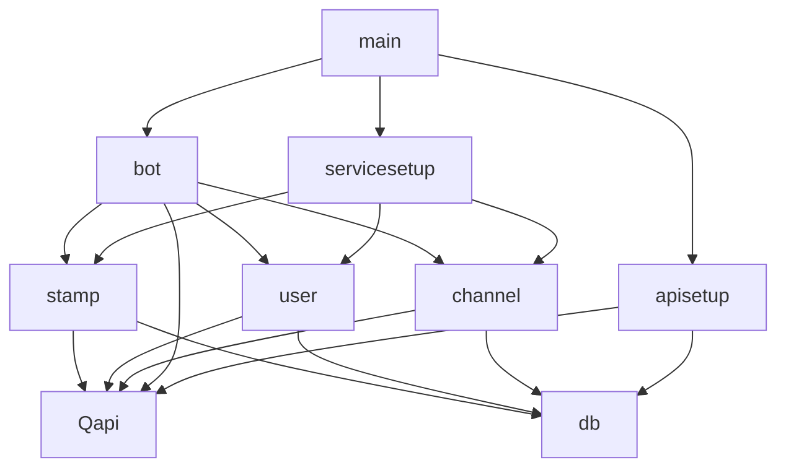

# Server パッケージ構成の見直し

## mainパッケージ
- 実行系のスクリプト
  - main.go
  - cron.go(定時実行関連)
  - root.go(ルーティング関連)
  - record.go(アプリ内情報保持関連)

## botパッケージ
- traQBOT関連のパッケージ
  - bot.go(セットアップ関連)
  - command.go(コマンド対応系)

## dbパッケージ
- db関連パッケージ
  - テーブル名引数にとったメソッド作ると楽そう

## traQAPIパッケージ
- traQAPIを叩くパッケージ
  - どこまでを含めるかは要検討
  - メッセージならその取得まではこのパッケージでやりたい(serviceパッケージではこちらで定義したmodelですべて対応したい)
  - ID<->displayname変換などの処理もここ
- 将来的にこれだけ独立させて公開しても良いかも(それを見越して作れば良さそう)

## 今後具体的なクラス相当の設計を考える
