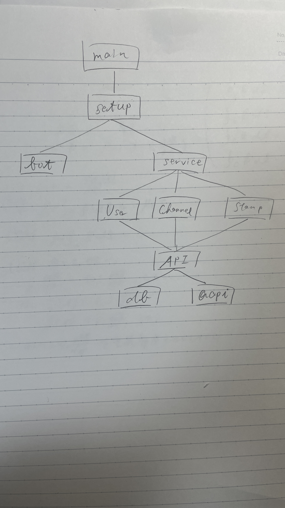

# サーバ設計関連資料

## パッケージ
- [readme](../README.md)参照


## Botパッケージ
- botのコマンドやbotからのサーバへのアクセスを管理
- 他のパッケージからは独立したものとして扱う(他のパッケージのメソッドにBotパッケージの関数は入らない)
  - Botからサーバのメソッドを呼び出すイメージとしてはservice.User.Hoge()みたいな感じで書くことになりそう
  - Service系パッケージ内にはあくまでBOT出力用の関数が生える感じ

### BOT
```
type Bot struct {
  bot *traqwsbot.Bot // traqBot
}
```

## APIパッケージ
- db,qapiパッケージを格納するパッケージ
- 設計上は最下層の一つ上に位置する
- サーバの各サービスごとにインスタンス化(?)される

### API
```
type API struct{
  db *db.DB // db関連
  qapi *qapi.Qapi // traqApi関連
}
```

## DBパッケージ
- dbのセットアップ及びdb操作をするメソッドの集まったパッケージ
- 設計上の最下層

### DB
```
type DB struct{
  db *sqlx.DB // sqlx.db
}
```

## Qapiパッケージ
- traQのAPIラッパーを用いてAPIを叩くメソッドの集まったパッケージ
- 設計上の最下層

### Qapi
```
type Qapi struct {
  auth context.Context // 認証関連
  client *traq.APIClient // traqAPIClient
}
```


## struct関連
- メソッドは略
- 各パッケージにhandler.goを用意しそこにインスタンス化を定義 model.goも用意

### Server
```
type Server struct{
  bot *bot.Bot // Bot関連
  db *db.DB // db関連
  qapi *qapi.Qapi // traqApi関連
  serverData ServerData // 保持しておくデータ
}
```

### serverData
```
type serverData struct {
  lastTrackMessage traq.Message // 最後に取得したメッセージ
  lastTrackTime time.Time // 最後の取得日時
  // 増えたらここに書く
}
```


